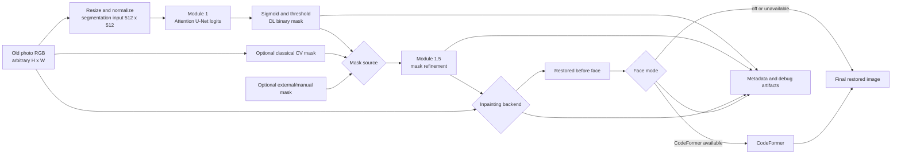
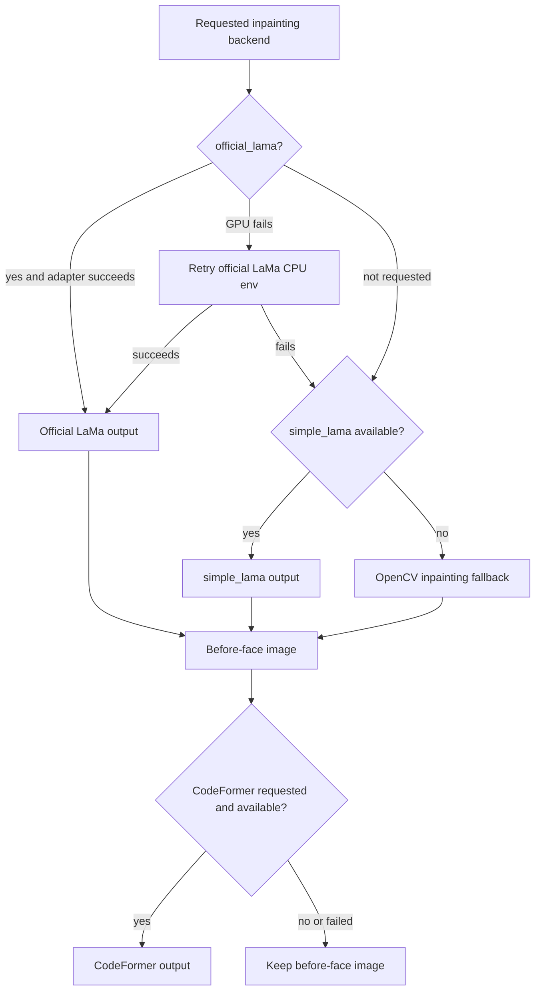
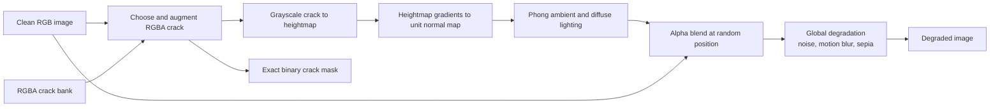
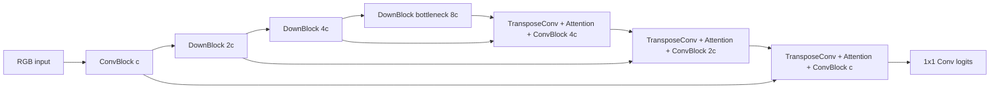
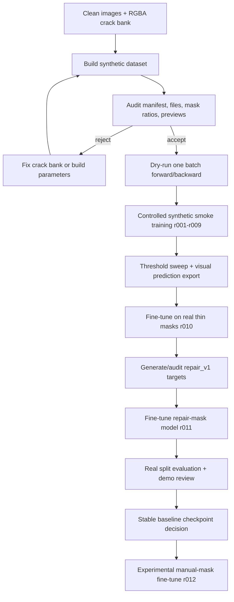

# Old Photo Restoration Blueprint 2.1

## Bao cao ky thuat song ngu / Bilingual Technical Report

> **Audience / Doi tuong:** Internal engineering team / Nhom ky thuat noi bo  
> **Report date / Ngay bao cao:** 2026-06-06  
> **System status / Trang thai he thong:** Functional research pipeline; `r011` is the stable automatic segmentation baseline, not a solved final system.

## 0. Evidence and Status Policy / Quy uoc bang chung va trang thai

Bao cao tach ro kien truc muc tieu trong [ARCHITECTURE.md](../ARCHITECTURE.md), code dang ton tai trong `src/` va `scripts/`, va ket qua duoc ghi nhan trong tai lieu/registry. Viec tach nay ngan chan viec mo ta Blueprint nhu mot tinh nang da hoan thanh.

This report separates the target architecture in [ARCHITECTURE.md](../ARCHITECTURE.md), the implementation currently present in `src/` and `scripts/`, and results recorded in documentation or registries. This prevents target Blueprint features from being presented as completed work.

| Label | Y nghia / Meaning |
|---|---|
| **Implemented** | Co code va duong chay trong repo / Code and an execution path exist in the repository. |
| **Experimental** | Da co prototype/checkpoint/adapter nhung chua du bang chung de lam default / A prototype, checkpoint, or adapter exists but is not sufficiently validated as the default. |
| **Planned** | Kien truc muc tieu hoac future work, chua hoan thanh / Target architecture or future work, not completed. |
| **Reported Evidence** | Metric/trang thai duoc tai lieu hoac registry ghi nhan, nhung artifact goc khong co trong workspace hien tai / A metric or status recorded by docs or registries whose original artifact is not present in the current workspace. |
| **Locally Verified** | Da kiem tra truc tiep trong workspace hien tai / Directly verified in the current workspace. |

**Current local verification note / Ghi chu kiem chung cuc bo:** `pytest -q` khong collect duoc test trong moi truong hien tai do thieu `cv2`, loi import `src`, va loi khoi tao PyTorch DLL `c10.dll`. Phan lon lenh `--help` cung bi chan vi cac script import dependency truoc khi parse CLI.

**Current local verification note:** `pytest -q` cannot collect the suite in the current environment because `cv2` is missing, `src` cannot be imported in one collection path, and PyTorch fails to initialize `c10.dll`. Most `--help` commands are also blocked because scripts import runtime dependencies before parsing CLI arguments.

---

## 1. Executive Summary / Tom tat dieu hanh

### Tieng Viet

Du an giai bai toan phuc hoi anh cu bi suy thoai hon hop. Suy thoai **co cau truc** nhu vet nut, vet xuoc, vet rach can duoc dinh vi bang mask; suy thoai **khong cau truc** nhu noise, blur va phai mau anh huong toan anh. Thiet ke chia pipeline thanh cac module chuyen biet de co the danh gia va thay the tung thanh phan.

Pipeline da trien khai gom: segment repair mask bang U-Net Attention nho, tuy chon hop nhat tin hieu CV, tinh chinh mask, inpainting bang official LaMa/simple_lama/OpenCV, va tuy chon CodeFormer. Dong gop ky thuat noi bat nhat la qua trinh tao du lieu crack synthetic co normal map/Phong lighting va qua trinh giam domain gap tu synthetic-only sang real-domain repair masks.

`r011` la stable automatic segmentation baseline hien tai, khong phai loi giai hoan chinh. Bang chung duoc bao cao cho thay r009 synthetic-only that bai tren anh that, r010 real-domain fine-tune cai thien manh, va r011 repair-mask fine-tune tiep tuc cai thien. Chat luong mask van la bottleneck chinh cua toan pipeline.

### English

The project addresses mixed-degradation old-photo restoration. **Structured** degradation such as cracks, scratches, and tears must be localized with a mask, while **unstructured** degradation such as noise, blur, and color fading affects the whole image. The system is split into specialized modules so each component can be evaluated and replaced independently.

The implemented pipeline contains a lightweight Attention U-Net repair-mask segmenter, optional classical-CV union, mask refinement, inpainting through official LaMa/simple_lama/OpenCV, and optional CodeFormer restoration. The main technical contributions are a physically inspired synthetic crack-generation pipeline using normal maps and Phong lighting, and the progression from a synthetic-only model toward real-domain repair-mask supervision.

`r011` is the current stable automatic segmentation baseline, not a complete solution. Reported evidence shows that synthetic-only r009 failed on real photographs, r010 real-domain fine-tuning delivered a large improvement, and r011 repair-mask fine-tuning improved further. Mask quality remains the main end-to-end bottleneck.

### Module Status / Trang thai module

| Module | Status | Current implementation / Trien khai hien tai |
|---|---|---|
| Data degradation | **Implemented** | Heightmap, 3D normal map, Phong illumination, crack augmentation, alpha blending, global degradation. |
| Module 1 segmentation | **Implemented** | Lightweight Attention U-Net; stable baseline `r011`. |
| Module 1.5 mask refinement | **Implemented** | Morphology, small-component removal, line-gap bridging, repair profiles. |
| Module 2 inpainting | **Implemented** | Official LaMa adapter, simple_lama fallback, OpenCV fallback. LaMa fine-tune is **Planned**. |
| Module 3 face restoration | **Experimental** | Dependency-gated CodeFormer subprocess adapter. |
| Gradio application | **Implemented** | Interactive wrapper around the final pipeline. |
| ResNet-34 encoder + deep supervision | **Planned** | Blueprint target, not the current segmenter. |

---

## 2. Problem Definition and Design Rationale / Bai toan va ly do thiet ke

### Tieng Viet

Mot anh cu co the dong thoi chua nhieu loai suy thoai:

- **Structured degradation:** crack, scratch, fold, tear, missing region. Chung co vi tri cu the va can mask repair.
- **Unstructured degradation:** noise, blur, sepia/fading, contrast loss. Chung co the trai rong tren toan anh.

He thong chon huong **divide and conquer** thay vi mot mang end-to-end duy nhat. Segmentation toi uu cho bai toan du doan pixel hiem; inpainting toi uu cho viec sinh texture/noi dung trong vung mask; face restoration toi uu cho khuon mat. Cach tach module giup truy vet loi thanh `mask_error`, `inpainting_error`, hoac `codeformer_error`.

Repair mask la hop dong quan trong nhat. Mask qua hep lam con vet nut; mask qua rong xoa texture that va buoc inpainting phai bia them noi dung. Vi vay muc tieu Module 1 khong chi la detect centerline cua crack ma la du doan vung can sua.

### English

An old photograph may contain several degradation types at once:

- **Structured degradation:** cracks, scratches, folds, tears, and missing regions. These have explicit locations and require repair masks.
- **Unstructured degradation:** noise, blur, sepia/fading, and contrast loss. These may affect the entire image.

The system follows a **divide-and-conquer** design instead of relying on one end-to-end network. Segmentation is optimized for sparse pixel prediction, inpainting for generating texture and content inside a mask, and face restoration for human faces. This separation supports root-cause attribution into `mask_error`, `inpainting_error`, and `codeformer_error`.

The repair mask is the most important interface. An undersized mask leaves visible damage; an oversized mask removes valid texture and forces inpainting to invent additional content. Module 1 therefore aims to predict the region that should be repaired, not only the crack centerline.

---

## 3. End-to-End Pipeline / Pipeline dau-cuoi



### Dependency and Fallback Graph / So do dependency va fallback



### Interface Contracts / Hop dong input-output

| Stage | Input | Output | Range and notes / Mien gia tri va ghi chu |
|---|---|---|---|
| Raw image I/O | Image file | RGB `uint8 [H,W,3]` | `[0,255]`; arbitrary input size. |
| Segmentation preprocessing | RGB array | `float32 [1,3,512,512]` | `[0,1]`; current default image size is 512. |
| Segmenter | Image tensor | logits `[B,1,512,512]` | Apply sigmoid, resize probability mask to original size, then threshold. |
| Final mask | DL/CV/external mask | `uint8 [H,W]` | Binary `{0,255}` after source selection and refinement. |
| Inpainting | RGB image + binary mask | RGB `uint8 [H,W,3]` | Actual backend and fallback chain must be recorded. |
| Face restoration | Before-face RGB | Final RGB `uint8 [H,W,3]` | If unavailable or failed, preserve the before-face image. |

### Main Output Artifacts / Artifact dau ra chinh

Moi final-pipeline run tao thu muc `<output-root>/<image-stem>/<mode>/`.

Each final-pipeline run creates `<output-root>/<image-stem>/<mode>/`.

| Artifact | Purpose / Muc dich |
|---|---|
| `input.png` | Input snapshot. |
| `dl_prob_mask.png` | Segmentation probability visualization when saved. |
| `cv_mask.png`, `union_mask.png`, `external_mask.png` | Candidate mask sources when available. |
| `final_mask_before_refine.png`, `final_mask_refined.png`, `final_mask.png` | Mask lineage and final repair mask. |
| `overlay_final.png` | Visual mask inspection. |
| `restored_before_face.png`, `restored_final.png` | Result before and after optional face restoration. |
| `comparison_grid.png` | Human-review contact sheet. |
| `metadata.json` | Requested/actual backend, fallback, thresholds, warnings, and module status. |

---

## 4. Data Pipeline / Pipeline du lieu

### 4.1 Sources and Splits / Nguon va cach chia

### Tieng Viet

- Synthetic clean-image sources duoc thiet ke cho DIV2K va FFHQ; `configs/data.yaml` hien tro toi DIV2K va processed crack bank.
- Crack bank duoc chuan hoa thanh RGBA de alpha channel bieu dien hinh dang vet nut.
- Dataset synthetic active duoc ghi la `ds-crack3d-512-n1000-v001`, gom 800 train va 200 validation samples theo [CHANGELOG.md](CHANGELOG.md).
- Real-domain dataset duoc tai lieu ghi nhan gom 60 pairs, chia train 42, val 9, test 9. Dataset nay nam ngoai repo.
- Manual/external masks chi la upper bound va cong cu chan doan, khong phai ket qua automatic.

### English

- Synthetic clean-image sources are designed around DIV2K and FFHQ; `configs/data.yaml` currently points to DIV2K and a processed crack bank.
- The crack bank is normalized to RGBA so the alpha channel represents crack geometry.
- The active synthetic dataset is recorded as `ds-crack3d-512-n1000-v001`, with 800 training and 200 validation samples according to [CHANGELOG.md](CHANGELOG.md).
- The documented real-domain dataset contains 60 pairs split into 42 train, 9 validation, and 9 test samples. This dataset is stored outside the repository.
- Manual/external masks are upper bounds and diagnostic tools, not automatic results.

### 4.2 Physically Inspired Synthetic Degradation / Suy thoai synthetic co cam hung vat ly



`src/data/degradation.py` thuc hien:

1. `compute_heightmap`: invert va Gaussian blur crack grayscale, chuan hoa ve `[0,1]`.
2. `compute_normal_map`: tinh `N = normalize([-dH/dx*s, -dH/dy*s, 1])`.
3. `apply_phong_illumination`: dung `I = ambient + diffuse * max(dot(N,L), 0)`.
4. `augment_crack`: scale, rotate, horizontal/vertical flip.
5. `alpha_blend`: tron crack va anh sach theo alpha.
6. `add_global_degradation`: Gaussian noise, motion blur va sepia/color fading.

The implementation produces a degraded RGB image and an exact binary crack mask. Dataset builders also write a manifest, statistics, metadata, config snapshots, and previews so samples can be audited and traced.

### 4.3 Dataset Contract and Augmentation / Hop dong dataset va augmentation

`CrackSegDataset` doc `manifest.csv` neu co; neu khong, no ghep anh va mask theo filename stem. Moi sample tra:

`CrackSegDataset` reads `manifest.csv` when available; otherwise, it pairs images and masks by filename stem. Each sample returns:

```text
image: float32 [3,512,512], range [0,1]
mask:  float32 [1,512,512], range {0,1}
```

| Profile | Train transformations / Bien doi train |
|---|---|
| `baseline` | Resize, horizontal flip, occasional vertical flip, random 90-degree rotation. |
| `strong` | Resize, flips, affine rotation, brightness/contrast, occasional elastic distortion. |
| validation | Resize and normalize only. |

### 4.4 Mask Semantics / Y nghia mask

| Mask type | Meaning / Y nghia | Usage / Cach dung |
|---|---|---|
| Thin mask | Crack centerline or narrow annotated damage. | Detection-oriented supervision and evaluation. |
| Repair mask | Wider region including crack core, edges, shadow, and nearby broken paper. | Preferred target for inpainting-oriented segmentation. |
| Manual/oracle mask | Human-created repair region. | Upper-bound diagnosis; never present as automatic output. |

---

## 5. Module 1: Crack and Repair Segmentation / Phan doan vet nut va vung sua

### 5.1 Actual Architecture / Kien truc thuc te

**Implemented:** `src/models/segmenter.py` contains a lightweight Attention U-Net, not a ResNet-34 encoder.



- Moi `ConvBlock` gom hai lop `Conv2d + BatchNorm + ReLU`.
- Moi `UpBlock` dung transposed convolution, Attention Gate tren skip feature, concat, roi ConvBlock.
- `base_channels` mac dinh la 8; r004 thu nghiem 32 channels.
- Output la logits mot kenh. Sigmoid va threshold chi duoc ap dung khi tinh metric/inference.
- **Planned:** ResNet-34/pretrained encoder va deep supervision trong Blueprint chua duoc trien khai.

Each `ConvBlock` contains two `Conv2d + BatchNorm + ReLU` sequences. Each `UpBlock` uses transposed convolution, applies an Attention Gate to the skip feature, concatenates features, and applies a ConvBlock. The model emits one-channel logits. ResNet-34 and deep supervision are target architecture items, not current behavior.

### 5.2 Loss Functions / Ham mat mat

Crack pixels are sparse relative to the background, so plain pixel accuracy is misleading. The project implements BCE combined with Dice or Tversky.

**Binary cross-entropy with logits**

```math
L_{BCE} = -\frac{1}{N}\sum_i y_i\log(\sigma(z_i)) + (1-y_i)\log(1-\sigma(z_i))
```

BCE provides stable pixel-wise supervision but can be dominated by background pixels.

**Dice loss**

```math
L_{Dice} = 1 - \frac{2\sum_i p_i y_i + \epsilon}{\sum_i p_i + \sum_i y_i + \epsilon}
```

Dice directly optimizes overlap and is useful for class imbalance.

**Tversky loss**

```math
L_{Tversky} = 1 - \frac{TP+\epsilon}{TP+\alpha FP+\beta FN+\epsilon}
```

With `alpha=0.3`, `beta=0.7`, false negatives receive greater weight, which is useful when missing a crack is more damaging than moderately expanding a mask.

**Implemented combinations**

```math
L = w_{BCE} L_{BCE} + w_{Dice} L_{Dice}
```

or

```math
L = w_{BCE} L_{BCE} + w_{Tversky} L_{Tversky}
```

### 5.3 Metrics / Chi so

| Metric | Formula | Interpretation / Dien giai |
|---|---|---|
| IoU | `TP / (TP + FP + FN)` | Primary overlap metric. |
| F1 | `2TP / (2TP + FP + FN)` | Harmonic balance of precision and recall. |
| Precision | `TP / (TP + FP)` | Controls false-positive repair regions. |
| Recall | `TP / (TP + FN)` | Measures damage coverage; low recall leaves cracks behind. |

Threshold sweep is required because the metric-best threshold may differ from `0.5`. The final sensitive mode uses threshold `0.15` for demo3 and must not be treated as a global default.

### 5.4 Mask Source and Refinement / Nguon mask va tinh chinh

| Mode | Behavior / Hanh vi |
|---|---|
| `auto_r011` | DL mask from stable r011 checkpoint. |
| `auto_r011_union` | Union of DL and classical-CV candidate mask. |
| `auto_r011_refined` | DL mask followed by conservative repair refinement. |
| `auto_r011_union_refined` | DL + CV union followed by refinement; current default candidate. |
| `auto_r011_sensitive_low_threshold` | High-recall experimental mode for selected demo cases. |
| `external` | Manual/external mask upper bound; requires `--external-mask`. |

Module 1.5 removes small components, bridges line-like gaps, performs closing, and dilates masks. Aggressive refinement can improve crack coverage but also increases false positives.

---

## 6. Module 2: Inpainting / Dien khuyet

### Tieng Viet

LaMa duoc chon vi Fast Fourier Convolution cung cap global receptive field phu hop voi vet nut dai va vung khuyet can ngu canh xa. Tuy nhien repo khong chua implementation train LaMa tu dau; pipeline dung pretrained backend qua adapter.

Thu tu backend thuc te:

1. `official_lama`: adapter subprocess, thu GPU env truoc va co the retry CPU env.
2. `simple_lama`: fallback pretrained on dinh hon va nhanh hon trong mot so runtime.
3. `opencv`: classical fallback cuoi cung.

`fine_tuned_lama` duoc khai bao trong CLI nhung pipeline chu dong bao loi vi chua co adapter/checkpoint fine-tuned hop le. LaMa fine-tune la **Planned**.

Mask thieu dan den vet nut con lai. Mask du dan den mat texture that, bien dang va noi dung bi bia them. Vi vay khong the danh gia inpainting tach roi khoi chat luong mask.

### English

LaMa is selected because Fast Fourier Convolution provides a global receptive field suitable for long cracks and missing regions that require distant context. The repository does not train LaMa from scratch; the pipeline invokes pretrained backends through adapters.

The operational backend order is:

1. `official_lama`: subprocess adapter that probes a GPU environment first and may retry a CPU environment.
2. `simple_lama`: a stable pretrained fallback that may be faster in some runtimes.
3. `opencv`: the final classical fallback.

`fine_tuned_lama` appears in the CLI but intentionally raises an error because no valid fine-tuned checkpoint and inference adapter have been integrated. LaMa fine-tuning is **Planned**.

An undersized mask leaves damage behind. An oversized mask destroys valid texture and increases hallucination. Inpainting quality therefore cannot be interpreted independently from mask quality.

---

## 7. Module 3: Face Restoration / Phuc hoi khuon mat

### Tieng Viet

Module 3 boc CodeFormer qua subprocess adapter va moi truong rieng. `face-mode=off` bo qua module. `auto` hoac `codeformer_if_available` chi ap dung CodeFormer khi repo/checkpoint/dependency can thiet san sang. Neu dependency thieu, adapter loi, hoac output khong doc duoc, pipeline giu nguyen `restored_before_face.png` va ghi ly do trong metadata.

Fidelity hien dung cho demo candidate la `0.7`. Gia tri nay can visual review vi CodeFormer co the lam mat gia, thay doi nhan dang, hoac tao artifact. Metadata `face_restoration_applied=true` va `face_backend=codeformer` la dieu kien de claim module da chay.

### English

Module 3 wraps CodeFormer through a subprocess adapter and a separate environment. `face-mode=off` bypasses the module. `auto` and `codeformer_if_available` only apply CodeFormer when the required repository, checkpoint, and dependencies are available. If dependencies are missing, the adapter fails, or the output cannot be read, the pipeline preserves `restored_before_face.png` and records the reason in metadata.

The current demo candidate uses fidelity `0.7`. This value requires visual review because CodeFormer may create artificial faces, alter identity, or introduce artifacts. Metadata values `face_restoration_applied=true` and `face_backend=codeformer` are required before claiming that face restoration ran.

---

## 8. Training Workflow / Quy trinh huan luyen



### 8.1 Actual Hyperparameter Sources / Nguon hyperparameter thuc te

`configs/data.yaml` contains paths and dataset-build parameters. The files `configs/segmenter.yaml`, `configs/generator.yaml`, and `configs/wandb.yaml` are currently empty. Training hyperparameters therefore come from CLI defaults/overrides and checkpoint metadata, which is a reproducibility gap.

| Parameter | Synthetic training default | Real fine-tune default |
|---|---:|---:|
| Image size | From active dataset, normally 512 | 512 |
| Batch size | 2 | 2 |
| Learning rate | `1e-3` | `1e-4` |
| Epochs | 5 for smoke CLI default | 40 |
| Loss | `bce_dice` | `bce_tversky` |
| BCE weight | 0.5 | 0.5 |
| Tversky alpha/beta | 0.5 / 0.5 unless overridden | 0.3 / 0.7 |
| Base channels | 8 | Loaded from initialization checkpoint |
| Early-stop patience | 8 | 10 |
| Seed | 42 | 42 |

### 8.2 Training Stages / Cac giai doan train

1. **Synthetic smoke training r001-r009:** validate data contracts, architecture capacity, loss weighting, augmentation, early stopping, and threshold calibration.
2. **Real-domain fine-tuning r010:** initialize from synthetic r009 and train on 60 documented real image-mask pairs.
3. **Repair-mask fine-tuning r011:** initialize from r010 and train against `repair_v1` masks designed for inpainting.
4. **Manual repair-mask r012:** experimental. It must not replace r011 without broader metric and visual evidence.
5. **LaMa fine-tuning:** planned only after a paired `image + mask + clean_target` dataset, baseline, checkpoint, and quantitative evaluation protocol exist.

---

## 9. Experiments and Results / Thi nghiem va ket qua

### 9.1 Controlled Synthetic Runs r001-r009 / Chuoi smoke synthetic

**Evidence status:** **Locally Verified** from `results/registry/*.csv`; checkpoints and original output images are not present in this workspace.

| Run | Main change / Thay doi chinh | Val IoU | Val F1 | Interpretation / Dien giai |
|---|---|---:|---:|---|
| r001 | 5-epoch lightweight baseline | 0.197967 | 0.306015 | Pipeline smoke success. |
| r002 | Longer 15-epoch baseline | 0.321141 | 0.455175 | Training duration materially helped. |
| r003 | Dice-heavy `0.3 BCE + 0.7 Dice` | 0.319957 | 0.448927 | Did not beat r002. |
| r004 | Increased capacity, `base_channels=32` | 0.306828 | 0.437265 | More capacity did not automatically improve results. |
| r005 | Up to 30 epochs + early-stop controls | 0.376162 | 0.519049 | Longer controlled training improved coverage. |
| r006 | Longer 50-epoch configuration | 0.385266 | 0.524996 | Incremental gain. |
| r007 | Strong augmentation | 0.391262 | 0.525779 | Improved synthetic validation robustness. |
| r008 | Strong augmentation + BCE/Tversky `alpha=.3 beta=.7` | 0.406438 | 0.549261 | Recall-oriented loss improved overlap. |
| r009 | Same direction, up to 60 epochs | **0.417199** | **0.559584** | Best recorded synthetic smoke run, not a final real-domain model. |

### 9.2 Main Real-Domain Progression / Tien trinh chinh tren anh that

**Evidence status:** **Reported Evidence** from [REAL_DOMAIN_R010_RESULTS.md](REAL_DOMAIN_R010_RESULTS.md), [REAL_DOMAIN_R010_R011_REPAIR_RESULTS.md](REAL_DOMAIN_R010_R011_REPAIR_RESULTS.md), and [BLUEPRINT21_IMPLEMENTATION_STATUS.md](BLUEPRINT21_IMPLEMENTATION_STATUS.md). Original external dataset, checkpoints, and evaluation outputs are not present in the current workspace.

| Model | Target and split | Threshold | IoU | F1 | Precision | Recall |
|---|---|---:|---:|---:|---:|---:|
| r009 synthetic-only | thin mask, real test | 0.10 | 0.002222 | 0.004434 | 0.083464 | 0.002277 |
| r010 real fine-tuned | thin mask, real test | 0.70 | 0.292728 | 0.452884 | 0.509123 | 0.407834 |
| r011 repair fine-tuned | repair_v1, test | 0.70 | **0.447877** | **0.618667** | 0.613738 | 0.623676 |
| r011 repair fine-tuned | thin original, test | 0.80 | 0.371838 | 0.542102 | 0.493531 | 0.601276 |

### Analysis / Phan tich

- r009 validates the synthetic pipeline but demonstrates an extreme domain gap on real photos.
- r010 shows that real-domain fine-tuning is essential.
- r011 shows that aligning the target with the actual repair region improves inpainting-oriented segmentation.
- r011 scoring differently on repair and thin masks exposes a supervision trade-off, not a contradiction.
- r012 remains **Experimental**; current evidence does not justify calling it superior.

### 9.3 Inpainting Prototype Evidence / Bang chung prototype inpainting

**Reported Evidence** in [REPORT_EVIDENCE.md](REPORT_EVIDENCE.md) records a focused `n=30` review stored outside the repository:

| Mode | PSNR | SSIM | Masked MAE used | Interpretation |
|---|---:|---:|---:|---|
| simple_lama pred@0.90 d0 | 42.304505 | 0.995744 | 25.183271 | Metric-best recorded prototype mode. |
| simple_lama pred@0.70 d0 | 41.382561 | 0.995261 | 25.400720 | Balanced coverage fallback. |
| opencv pred@0.70 d0 | 39.557140 | 0.994169 | 32.144498 | Classical sanity-check baseline. |

These numbers must not be interpreted as final real-photo restoration quality because the original bundle is outside the current workspace and full LPIPS/FID evaluation is incomplete.

### 9.4 Ablation Matrix / Ma tran ablation

| Case | Configuration | Question / Cau hoi |
|---|---|---|
| A | OpenCV fallback | Is the fallback path always operational? |
| B | r011 default + official LaMa + face off | What is the main pipeline baseline? |
| C | r011 sensitive + official LaMa + face off | Does higher recall justify added false positives? |
| D | r011 + official LaMa + CodeFormer `0.7` | Does face restoration improve faces without identity/artifact regressions? |
| E | External/oracle mask + official LaMa | If the mask is good, is inpainting still the bottleneck? |

Automatic and external/oracle outputs must be reported separately. Oracle masks are diagnostic ceilings, never automatic model results.

---

## 10. Operational Runbook / Huong dan van hanh

All commands below are PowerShell commands executed from the project root. Commands that depend on OpenCV or PyTorch currently fail in the active local environment until the dependency problems described in Troubleshooting are fixed.

### 10.1 Environment Setup / Cai dat moi truong

**Prerequisites:** Python 3.10-compatible environment, enough disk space, and an optional NVIDIA GPU.

```powershell
conda create -n old_photo python=3.10 -y
conda activate old_photo
pip install -r requirements.txt
```

**Expected output:** imports for `torch`, `cv2`, `numpy`, and project modules succeed.  
**Common failure:** installing a CPU/GPU PyTorch build incompatible with the local driver or Windows runtime.

Basic readiness:

```powershell
python -c "import cv2, torch; print(cv2.__version__); print(torch.__version__); print(torch.cuda.is_available())"
python -c "import sys; sys.path.insert(0, '.'); import src; print('src import ok')"
```

### 10.2 Build and Audit Synthetic Data / Tao va audit du lieu synthetic

**Prerequisites:** clean images and processed RGBA crack bank at paths configured in `configs/data.yaml`.

```powershell
python scripts\build_dataset.py `
  --config configs\data.yaml `
  --num-samples 1000 `
  --image-size 512 `
  --val-ratio 0.2 `
  --seed 42 `
  --version v001 `
  --num-previews 12
```

**Expected output:** `data\processed\<dataset-id>\` containing train/val images, masks, manifest, statistics, metadata, and previews.  
**Common failure:** empty source folders, invalid RGBA cracks, excessive mask ratio, or refusing to overwrite an existing dataset.

```powershell
python scripts\audit_dataset.py `
  --dataset-id ds-crack3d-512-n1000-v001 `
  --config configs\data.yaml `
  --max-samples 50 `
  --mask-ratio-warn 0.10 `
  --mask-ratio-reject 0.20
```

**Expected output:** audit report and visual overlays. Training should not continue if files are missing or mask-ratio rejection is triggered.

### 10.3 Module 1 Dry Run and Synthetic Training / Dry-run va train synthetic Module 1

```powershell
python scripts\train_segmentation.py `
  --config configs\data.yaml `
  --dry-run `
  --batch-size 2 `
  --device auto
```

**Expected output:** one batch completes forward, loss, backward, and metric computation.  
**Common failure:** active dataset missing, PyTorch DLL/CUDA mismatch, or image/mask contract mismatch.

Controlled smoke training:

```powershell
python scripts\train_segmentation.py `
  --config configs\data.yaml `
  --smoke-run `
  --run-id seg-unet-attn-example-s42 `
  --epochs 30 `
  --batch-size 2 `
  --lr 0.001 `
  --loss-type bce_tversky `
  --bce-weight 0.5 `
  --tversky-alpha 0.3 `
  --tversky-beta 0.7 `
  --base-channels 8 `
  --aug-profile strong `
  --patience 10 `
  --seed 42
```

**Expected output:** checkpoint directory, `best_iou.ckpt`, metrics history, experiment artifacts, and registry updates.  
**Common failure:** reusing an existing `run-id` without `--overwrite-run`.

### 10.4 Real-Domain Fine-Tuning / Fine-tune tren anh that

**Prerequisites:** external data root containing images, masks, and audited `train.txt`, `val.txt`, `test.txt`; initialization checkpoint exists.

```powershell
python scripts\finetune_real_segmentation.py `
  --data-root <external-real-dataset> `
  --image-dir images `
  --mask-dir masks `
  --split-dir <external-split-dir> `
  --init-checkpoint checkpoints\segmenter\<init-run>\best_iou.ckpt `
  --run-id seg-unet-attn-new-real-ft-s42 `
  --epochs 40 `
  --batch-size 2 `
  --lr 0.0001 `
  --loss-type bce_tversky `
  --tversky-alpha 0.3 `
  --tversky-beta 0.7 `
  --seed 42
```

**Expected output:** a new fine-tuned checkpoint and metrics without overwriting the initialization run.  
**Common failure:** mask convention mismatch, bad split files, missing checkpoint, or accidental run-ID reuse.

### 10.5 Threshold Evaluation and Prediction Export / Danh gia threshold va export du doan

Synthetic/active dataset threshold sweep:

```powershell
python scripts\evaluate_segmentation_thresholds.py `
  --run-id <run-id> `
  --dataset-id ds-crack3d-512-n1000-v001 `
  --split val `
  --threshold-start 0.20 `
  --threshold-end 0.90 `
  --threshold-step 0.05
```

```powershell
python scripts\export_segmentation_predictions.py `
  --run-id <run-id> `
  --dataset-id ds-crack3d-512-n1000-v001 `
  --split val `
  --num-samples 24 `
  --threshold 0.50
```

Real-domain evaluation:

```powershell
python scripts\evaluate_real_segmentation.py `
  --data-root <external-real-dataset> `
  --image-dir images `
  --mask-dir masks `
  --split-file <external-split-dir>\test.txt `
  --checkpoint checkpoints\segmenter\<run-id>\best_iou.ckpt `
  --output-dir outputs\evaluation\<run-id>\test `
  --thresholds 0.1,0.2,0.3,0.4,0.5,0.6,0.7,0.8,0.9
```

**Expected output:** threshold table, best metric summary, and visual predictions.  
**Common failure:** selecting a threshold from one domain and assuming it generalizes to another.

### 10.6 Single-Image Final Pipeline / Chay pipeline tren mot anh

**Prerequisites:** r011 checkpoint and at least one inpainting backend.

```powershell
python scripts\run_restoration_pipeline.py `
  --image data\demo_inputs\real_manual_3\demo3.png `
  --mode auto_r011_union_refined `
  --output-dir outputs\final_pipeline_assets\single_demo `
  --checkpoint checkpoints\segmenter\seg-unet-attn-r011-repair-ft-s42\best_iou.ckpt `
  --backend official_lama `
  --face-mode off
```

**Expected output:** mask lineage, restored images, comparison grid, and metadata.  
**Common failure:** missing checkpoint; unavailable official LaMa causes fallback; `fine_tuned_lama` intentionally fails because it is not integrated.

External/oracle diagnosis:

```powershell
python scripts\run_restoration_pipeline.py `
  --image <input-image> `
  --mode external `
  --external-mask <binary-mask> `
  --output-dir outputs\oracle_diagnosis `
  --backend official_lama `
  --face-mode off
```

### 10.7 Batch Suite, Review, and Gradio / Batch, review va Gradio

```powershell
python scripts\run_final_pipeline_suite.py `
  --demo-dir data\demo_inputs\real_manual_3 `
  --external-mask-dir data\demo_masks\real_manual_3 `
  --output-root outputs\final_pipeline_assets\demo_suite `
  --checkpoint checkpoints\segmenter\seg-unet-attn-r011-repair-ft-s42\best_iou.ckpt
```

```powershell
python scripts\run_batch_review.py `
  --input-dir data\demo_inputs\real_manual_3 `
  --max-images 3 `
  --backend official_lama `
  --mask-modes auto_r011_union_refined,auto_r011_sensitive_low_threshold `
  --face-restoration off
```

```powershell
python app_gradio.py
```

**Expected output:** batch comparison assets/review sheets or a local Gradio application.  
**Common failure:** Gradio or backend-specific environments are missing; metadata must be inspected to determine the backend that actually ran.

### 10.8 Troubleshooting / Xu ly loi

| Symptom / Trieu chung | Cause / Nguyen nhan | Resolution / Cach xu ly |
|---|---|---|
| `ModuleNotFoundError: cv2` | OpenCV missing in active environment. | Activate the intended env and install `opencv-python`; verify with `python -c "import cv2"`. |
| `ModuleNotFoundError: src` | Project root absent from Python import path or command run outside root. | Run from project root; for diagnostics, insert `.` into `sys.path` or set `PYTHONPATH` appropriately. |
| `WinError 1114` loading `c10.dll` | PyTorch/Windows runtime/CUDA mismatch. | Reinstall a compatible PyTorch build in a clean environment and verify import before project commands. |
| `--help` crashes before printing | Script imports heavy dependencies before `parse_args`. | Fix dependency environment first; use source `parse_args()` definitions as the temporary CLI reference. |
| Checkpoint missing | Checkpoints are gitignored/external. | Restore the expected checkpoint path or pass `--checkpoint` explicitly. |
| Requested backend differs from actual backend | Dependency unavailable or adapter failed. | Read `metadata.json`, `fallback_applied`, `fallback_chain`, and backend warning fields. |
| CodeFormer output unchanged | Module unavailable or subprocess failed. | Check `face_module\face_metadata.json`; only claim success when `face_restoration_applied=true`. |

---

## 11. Evaluation, Limitations, and Roadmap / Danh gia, gioi han va roadmap

### 11.1 Evaluation Protocol / Protocol danh gia

| Error class | Definition / Dinh nghia |
|---|---|
| `mask_error` | Missed damage or false-positive mask over real content such as faces, hair, clothing, edges, or texture. |
| `inpainting_error` | Reasonable mask but blurry, incorrect, structurally broken, or artificial inpainted content. |
| `codeformer_error` | Before-face result is better, while CodeFormer introduces identity, geometry, skin-texture, or artifact regressions. |

Review sheets should record image ID, configuration, requested and actual backend, fallback status, mask ratio, face-restoration status, quality score, error classes, and notes. Quantitative mask metrics and visual end-to-end review are both required.

### 11.2 Current Limitations / Gioi han hien tai

- Mask generation remains the main bottleneck, especially for long, faint cracks and hard negatives.
- The documented real dataset contains only 60 pairs.
- r011 is stable but is not a solved final result.
- r012 is experimental and not proven superior.
- Official LaMa and CodeFormer are pretrained external systems; they were not trained from scratch in this project.
- LaMa fine-tuning has not been completed.
- Broader LPIPS, FID, and masked-region evaluation is incomplete.
- A one-image smoke test recorded official LaMa GPU at about 44.15 seconds and CPU at about 38.51 seconds; GPU availability is proven, speedup is not.
- The current workspace lacks the external real dataset, checkpoints, and many output artifacts required to reproduce reported metrics locally.
- Empty `segmenter.yaml`, `generator.yaml`, and `wandb.yaml` files weaken configuration reproducibility.

### 11.3 Blueprint-to-Implementation Gap Matrix / Ma tran khoang cach

| Area | Blueprint target | Current implementation | Status |
|---|---|---|---|
| Segmenter encoder | ResNet-34 pretrained | Custom lightweight convolutional encoder | **Planned gap** |
| Deep supervision | Multi-scale losses | Single final output head | **Planned gap** |
| Segmentation target | Crack/repair mask | r011 repair-mask baseline implemented | **Implemented**, still imperfect |
| LaMa training | Fine-tuned on project data | Pretrained adapters and fallbacks | **Planned gap** |
| Face restoration | Reliable conditional module | Dependency-gated CodeFormer adapter | **Experimental** |
| Metrics | LPIPS, FID, PSNR, SSIM, segmentation metrics | Segmentation metrics strong; restoration metrics partial | **Partial** |
| Configuration | Hyperparameters centralized in YAML | Data YAML populated; model/W&B YAML files empty; CLI carries many values | **Gap** |
| Reproducibility | Local artifacts and repeatable environments | Many datasets/checkpoints/artifacts external | **Gap** |

### 11.4 Prioritized Roadmap / Roadmap uu tien

1. **Data and evidence first:** expand and audit real repair-mask data; preserve dataset index, split, provenance, and hard-negative labels.
2. **Improve Module 1:** compare r011 with a pretrained encoder/deep-supervision candidate using the same real split, threshold protocol, and visual review.
3. **Strengthen end-to-end evaluation:** add masked-region metrics, LPIPS/FID where valid, and a larger structured human-review set.
4. **Stabilize configuration and environments:** populate YAML configs, pin environments, and make CLI help available without importing heavy runtimes.
5. **Only then fine-tune LaMa:** require paired clean targets, a pretrained baseline, an isolated environment, a checkpoint, and evidence that the fine-tuned backend actually ran.
6. **Promote CodeFormer only after review:** require applied metadata and consistent identity-preserving visual benefit.

---

## 12. Appendices / Phu luc

### A. Compact Command Reference / Tham chieu lenh nhanh

| Goal / Muc tieu | Command |
|---|---|
| Build synthetic data | `python scripts\build_dataset.py --config configs\data.yaml --num-samples 1000` |
| Audit active data | `python scripts\audit_dataset.py --dataset-id ds-crack3d-512-n1000-v001` |
| Segmentation dry-run | `python scripts\train_segmentation.py --dry-run` |
| Synthetic smoke train | `python scripts\train_segmentation.py --smoke-run --run-id <run-id>` |
| Real fine-tune | `python scripts\finetune_real_segmentation.py --data-root <root> --split-dir <splits> --init-checkpoint <ckpt> --run-id <run-id>` |
| Threshold sweep | `python scripts\evaluate_segmentation_thresholds.py --run-id <run-id> --dataset-id <dataset-id>` |
| Real evaluation | `python scripts\evaluate_real_segmentation.py --data-root <root> --split-file <test.txt> --checkpoint <ckpt> --output-dir <out>` |
| Single-image pipeline | `python scripts\run_restoration_pipeline.py --image <image> --output-dir <out> --mode auto_r011_union_refined` |
| Gradio | `python app_gradio.py` |

### B. Terminology / Thuat ngu

| Vietnamese | English |
|---|---|
| anh cu | old photograph |
| suy thoai hon hop | mixed degradation |
| vet nut / vet xuoc | crack / scratch |
| mask phat hien mong | thin detection mask |
| mask vung sua | repair mask |
| dien khuyet | inpainting |
| tinh chinh mask | mask refinement |
| nguong nhi phan | binary threshold |
| khoang cach mien | domain gap |
| mat can bang lop | class imbalance |
| gioi han tren / chan doan | upper bound / diagnosis |

### C. Evidence Index / Chi muc bang chung

| Claim / Tuyen bo | Evidence | Status |
|---|---|---|
| Current module/pipeline status | [FINAL_PIPELINE_STATUS.md](FINAL_PIPELINE_STATUS.md) | **Reported Evidence** |
| Final modes and output artifacts | [FINAL_PIPELINE_USAGE.md](FINAL_PIPELINE_USAGE.md) and source entrypoints | **Locally Verified** for source; runtime not locally verified |
| r001-r009 controlled synthetic metrics | `results/registry/experiment_registry.csv`, `results/registry/metric_registry.csv` | **Locally Verified** registry |
| r009-r010 real-domain metrics | [REAL_DOMAIN_R010_RESULTS.md](REAL_DOMAIN_R010_RESULTS.md) | **Reported Evidence** |
| r011 training and evaluation | [REAL_DOMAIN_R010_R011_REPAIR_RESULTS.md](REAL_DOMAIN_R010_R011_REPAIR_RESULTS.md) | **Reported Evidence** |
| Blueprint implementation claims | [BLUEPRINT21_IMPLEMENTATION_STATUS.md](BLUEPRINT21_IMPLEMENTATION_STATUS.md) | **Reported Evidence** |
| Restoration prototype metrics | [REPORT_EVIDENCE.md](REPORT_EVIDENCE.md) | **Reported Evidence**, source bundle external |
| Evaluation protocol | [EVALUATION_PROTOCOL.md](EVALUATION_PROTOCOL.md) | **Locally Verified** document |
| Current source architecture | `src/models/segmenter.py`, `src/postprocess/mask_refinement.py`, `src/restoration/` | **Locally Verified** |
| Current local test failure | `pytest -q` run on 2026-06-06 | **Locally Verified** |

### D. Important Repository Structure / Cau truc repo quan trong

```text
configs/                 data paths and currently sparse model configs
src/data/                degradation, dataset, transforms
src/models/              Attention U-Net segmenter and Attention Gate
src/losses/              BCE/Dice/Tversky segmentation losses
src/postprocess/         repair-mask refinement
src/restoration/         backend checks, official LaMa and CodeFormer adapters
scripts/                 build, audit, train, evaluate, inference, review entrypoints
tests/                   data/model contract and smoke tests
results/registry/        experiment and metric registries
docs/                    architecture, evidence, status, protocol, and this report
```

### E. Final Engineering Position / Ket luan ky thuat

He thong hien tai la mot pipeline nghien cuu co the van hanh, co duong fallback va co kha nang truy vet loi. Thanh cong quan trong nhat la chung minh synthetic-only khong du cho anh cu that va repair-mask supervision phu hop hon voi muc tieu inpainting. Buoc tiep theo co gia tri cao nhat khong phai la them mot backend moi, ma la tang chat luong bang chung: du lieu repair-mask that tot hon, danh gia cung protocol, va cau hinh co the tai lap.

The current system is an operational research pipeline with fallbacks and root-cause traceability. Its most important result is demonstrating that synthetic-only supervision is insufficient for real old photographs and that repair-mask supervision better matches the inpainting objective. The highest-value next step is not another backend; it is stronger evidence through better real repair-mask data, consistent evaluation, and reproducible configuration.
